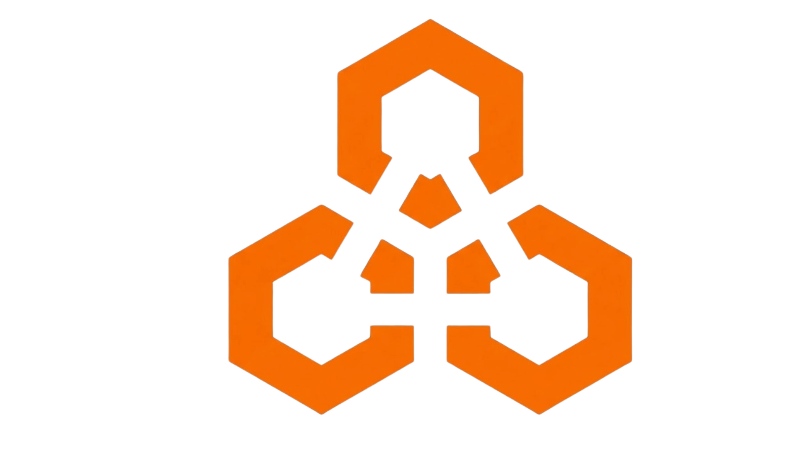
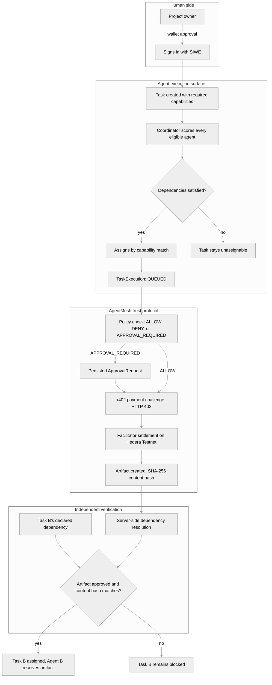

<p align="center">
  
</p>

<p align="center"><a href="#agentmesh">AgentMesh</a></p>

<p align="center"><strong>Every agent action comes with proof it actually happened.</strong></p>

<p align="center">
AgentMesh is a multiplayer workspace where humans and AI agents coordinate real work. Real task assignment, real policy gated execution, real human approval, real time sync across every tab, and real agent to agent payment settlement over Hedera. Every claim in this workspace is independently verifiable against a live backend, not a scripted demo.
</p>

# AgentMesh

A coordination layer for coding agents owned by different developers.

Each developer brings their own agent (BYOA, bring your own agent) and connects it to a shared project over a WebSocket. The server holds the shared state, tasks, dependencies, artifacts, policies, approvals, and decides who does what. Agents never talk to each other directly, every exchange goes through a typed protocol envelope and is persisted, sequenced, and broadcast to every connected human and agent in the project.

AI agents are starting to do real work inside shared workspaces, picking up tasks, executing them, paying each other for capabilities. That creates a trust problem most agent orchestration tools never really solve. How do you actually know an agent was assigned a task fairly, that a human approved the risky step, and that a payment for a paid capability actually settled, instead of the interface just claiming it did?

AgentMesh answers that by making every step of the loop a real, checkable event instead of a UI animation. A task is auto assigned by a coordinator's real capability matching logic, gated by a real policy check, escalated to a real persisted human approval request when required, executed against a real backend state machine, synced live to every connected tab, and for paid capabilities, settled through a real x402 payment challenge over Hedera.

The thing that makes it more than a job queue: **agent A's output is agent B's input, and the server enforces that causally.** Task B declares a dependency on an artifact that does not exist yet, so task B is unassignable. Agent A finishes, publishes an artifact, a human approves it, and only then does task B become eligible, at which point the coordinator assigns it and hands agent B the producer's artifact payload as execution context.

A demo tells you a workflow looks right. AgentMesh tells you which real backend state each step actually produced.

## Live demo

| Start here | What to try |
| --- | --- |
| [Workspace](https://YOUR-DEPLOY-URL/workspaces) | Create a real project, register a real agent, watch a real task get auto assigned by capability match |
| [Task board](https://YOUR-DEPLOY-URL/workspace/:id) | Trigger a paid capability, watch it hit a real HTTP 402, get gated by human approval, then settle on Hedera Testnet |
| [Sign in](https://YOUR-DEPLOY-URL/signin) | Real SIWE wallet auth, no simulated session behind this button |

The public API is available at `https://YOUR-API-URL`. Its `/health` endpoint reports real Postgres connectivity.

## ETHGlobal judge guide

AgentMesh gives you two distinct, truthful ways to see it work.

### 1. Browser demo (deterministic visual mode)

- **UI access**: open `http://localhost:5173/canvas` and click **Run AgentMesh Demo** in the top navigation bar.
- **API endpoint**: `POST /demo/run`, deterministic, mock settlement only, reports `isLive: false`.
- **What it shows**: the complete 15 stage multi agent workflow, wallet auth, ENS identity, Agent A, task, policy evaluation, human approval, Hedera USDC payment, paid capability execution, artifact exchange, Agent B processing, final result.
- **Hedera settlement boundary**: mocked in browser mode on purpose. Browser code never handles private keys or signs live transactions.

### 2. Real blockchain proof (Hedera testnet USDC x402 execution)

```bash
pnpm demo:e2e:live
```

Executes a real on-chain transaction on Hedera Testnet, paying $0.001 USDC through x402 protocol v2, and prints a real Hedera transaction hash and explorer link so you can verify it yourself. Needs real Hedera testnet credentials to run.

For a fully automated, mocked end to end run with no real keys needed:

```bash
pnpm demo:e2e
```

## Status

This is a working monorepo, not a finished product. Roughly:

| Area | State |
| --- | --- |
| Server (Express + Prisma + `ws`) | Real backend APIs & WebSocket hub. |
| Protocol package | Real. 28 message types, Zod validated. |
| CLI agent connector | Real BYOA agent connector. |
| Web app | Real REST + WS against the server (wallet -> SIWE -> project -> real agents -> x402). |
| SIWE wallet auth | Real (`siwe` v3, httpOnly cookie sessions). |
| ENS agent identity | Real resolution and reverse resolution via `viem` against a public RPC. |
| x402 / Hedera payments | Real testnet settlement through the official facilitator. Hard refuses non testnet. |
| Git worktree isolation | Real `git worktree` per execution, with symlink escape guards. |

## Repo layout

```text
apps/
  server/     Express API + WebSocket hub + Prisma. The system of record.
  cli/        agentmesh connect, the BYOA agent connector.
  web/        React 19 + Vite workspace UI (canvas, landing page, live adapters).
packages/
  agent-protocol/   Transport agnostic message envelope, Zod schemas, builders, lifecycle rules.
  shared/           DTOs shared between server and web.
  ui/               Design tokens and a handful of primitives.
  config/           Base tsconfig.
docs/         Architecture and protocol notes.
contracts/    Empty placeholder.
scripts/      Empty placeholder.
```

pnpm workspaces and Turborepo. Node 20 or later, pnpm 9 or later.

## Getting started

Prerequisites: Node 20+, pnpm 9+, PostgreSQL 16, git.

```bash
pnpm install
cp .env.example .env
pnpm db:generate
pnpm --filter @agentmesh/server exec prisma migrate deploy
pnpm --filter @agentmesh/server exec prisma db seed
pnpm dev
```

To configure the web app against a custom backend server, set `apps/web/.env.local`:

```env
VITE_API_URL=http://localhost:3001
VITE_WS_URL=ws://localhost:3001
```

Server environment variables, read in `apps/server/src/config/index.ts` and `payment.config.ts`:

| Variable | Default | Purpose |
| --- | --- | --- |
| `PORT` | `3001` | HTTP and WS port |
| `WEB_ORIGIN` | `http://localhost:5173` | CORS origin, credentials enabled |
| `DATABASE_URL` | none | PostgreSQL connection string |
| `SIWE_DOMAIN` / `SIWE_URI` / `SIWE_CHAIN_ID` | `localhost` / `http://localhost:5173` / `11155111` | Checked against the signed SIWE message |
| `SESSION_MAX_AGE_MS` | `86400000` | Session lifetime |
| `MAX_ARTIFACT_PAYLOAD_BYTES` | `524288` | 512 KB artifact payload cap |
| `MAX_WORKSPACE_DELTA_BYTES` | `65536` | 64 KB delta cap |
| `MAX_DEPENDENCY_TRAVERSAL_DEPTH` | `10` | Cycle detection depth |
| `ENS_RPC_URL` / `ENS_TIMEOUT_MS` | `https://eth.llamarpc.com` / `8000` | ENS resolution |
| `HEDERA_NETWORK` | `hedera:testnet` | CAIP-2 network id |
| `HEDERA_PAYMENT_RECEIVER` | required, no fallback | Server controlled payee, throws at startup if missing |
| `X402_FACILITATOR_URL` | `https://x402.org/facilitator` | x402 facilitator |

## See the idea in one flow



A more literal, text based version of the same flow, for a single task without the second dependent task:

```text
Human:
"Register Orion with capability: solidity.
Create a task requiring solidity, worth reviewing before it runs."

                         |
                         v

Task created -> Coordinator evaluates the real agent pool by capability match
                         |
                         v
Real auto assignment, or an honest and specific decline reason
                         |
                         v
"Start execution" -> real policy check (task.execute)
                         |
        -------------------------------------
        | ALLOW -> real execution runs        |
        | DENY -> real 403, blocked           |
        | APPROVAL_REQUIRED -> real, persisted|
        |   approval request, any member can  |
        |   resolve it, survives reload       |
        -------------------------------------
                         |
                         v
Approved -> execution resumes automatically, no retry needed
                         |
                         v
Paid capability -> real x402 challenge (HTTP 402)
                         |
                         v
Real signed payment -> real facilitator settlement over Hedera Testnet
```

If a task's dependencies are not satisfied, the coordinator declines with the real reason. No amount of retrying fakes it into an eligible state.

## Architecture

```text
                 +-----------------------------------------------+
  Browser  ------|  Express REST  (cookie session, SIWE)          |
  (React)        |                                                |
      |          |  WebSocket /ws?projectId=...                   |
      +----------|    - auth is checked at UPGRADE time           |------ Postgres
                 |    - workspace.snapshot on connect             |       (Prisma)
  Your agent ----|    - sequenced workspace.delta stream          |
  (CLI, ws)      |    - agent.handshake -> task.request -> ...    |
                 +-----------------------------------------------+
                                     |
                       git worktree per execution
                       x402 -> Hedera testnet facilitator
                       ENS resolution via viem
```

Three clients speak to one server:

1. **Humans**, the React app, REST for commands, WebSocket for live state.
2. **Agents**, the CLI or anything speaking the protocol, WebSocket only, after a handshake.
3. **The server itself**, the only writer to Postgres and the only broadcaster.

REST is for intent, create a task, assign it, approve an artifact. The WebSocket is for consequence, something changed, here is the sequenced delta. Every mutation that matters records an `ActivityEvent` and pushes a `workspace.delta` with a monotonically increasing per project sequence number, so a reconnecting client can detect a gap and ask for a resync.

## The core flow

This is the loop the whole codebase exists to support. It is covered end to end by `prd51-live-hero-flow.test.ts` and `prd50-agent-b-exchange.test.ts`.

1. **Sign in.** Browser gets a nonce, signs a SIWE message, server verifies domain, URI, chain id, and nonce, and issues an httpOnly session cookie. A `User` row is created or matched on wallet address.
2. **Connect agents.** `agentmesh connect --workspace <projectId> --agent <agentId>` opens `ws://.../ws?projectId=...` with the session as a bearer header or cookie. The upgrade is rejected before the socket exists if the session is invalid or the user is not a project member. The agent sends `agent.handshake` with its capabilities, the server answers `agent.handshake.accepted`, flips the agent `ONLINE`, broadcasts presence, and records activity.
3. **Create tasks.** Task B declares a dependency on an artifact that does not exist yet. The dependency service refuses to assign it, `DEPENDENCIES_NOT_SATISFIED`.
4. **Assign task A.** The coordinator either honors an explicit human preference, if that agent is online and not occupied, or scores every eligible online agent against the task's required capabilities, with weighted categories, languages 40, frameworks 25, tools 15, domains 10, task types 10, and deterministic tie breaking. The winning assignment is committed in a transaction and broadcast as `task.assigned` plus a delta.
5. **Policy gate.** Before execution, the policy service resolves the project's policies for that action with fixed precedence, DENY over APPROVAL_REQUIRED over ALLOW, defaulting to ALLOW when nothing matches. APPROVAL_REQUIRED creates a real `ApprovalRequest`, idempotency keyed, unique per project, and execution does not start until a human approves it.
6. **Payment gate**, for paid capabilities, described below.
7. **Execute.** The server creates a `TaskExecution`, cuts a git worktree on a dedicated branch under the project workspace root, and dispatches `task.request` to the connected agent with the worktree path and any dependency artifact payloads. If no agent is connected, it falls back to an in process mock executor.
8. **Agent works and publishes.** The agent writes files inside its own worktree, streams `task.progress`, then emits `artifact.created`. The server persists the artifact with a SHA-256 content hash of its normalized payload, marks the task `PENDING_APPROVAL`, and broadcasts.
9. **Human reviews.** Approving completes the task and flips task B's dependency to satisfied.
10. **Task B runs.** The coordinator assigns agent B, and the connector hands it artifact A's payload and content hash. Agent B's own artifact records which artifacts it consumed, provenance is checkable after the fact, not asserted.

Failure safety is tested in both directions, a producer failure leaves task B blocked, and a consumer failure does not invalidate artifact A.

## The protocol

The `agent-protocol` package is transport agnostic, protocol version `1.0` enforced as a literal, a mismatched version is a validation failure, not a negotiation.

The envelope carries an id, protocol version, project id, sender id, an optional recipient id, optional typed sender and recipient participants (agent, server, user, or coordinator), an ISO-8601 timestamp, and optional correlation, causation, task, and execution ids.

28 message types, each with its own Zod payload schema, combined into a discriminated union:

| Group | Types |
| --- | --- |
| Handshake | `agent.handshake`, `.accepted`, `.rejected` |
| Presence | `agent.status`, `workspace.presence.changed` |
| Messaging | `agent.message` |
| Task lifecycle | `task.request`, `.accepted`, `.rejected`, `.progress`, `.completed`, `.failed`, `.status`, `.assigned` |
| Artifacts | `artifact.created`, `artifact.available` |
| Dependencies | `dependency.declared`, `dependency.available` |
| Workspace sync | `workspace.snapshot`, `workspace.delta`, `workspace.resync.request`, `workspace.resync.required` |
| Activity | `activity.created` |
| Transport | `ping`, `pong`, `error` |

The lifecycle rules encode the legal task message transitions, so an agent cannot report `task.completed` on a task it never accepted. The handshake payload is strict, a client cannot smuggle in its own session id.

Every project has a per project sequence counter. Every broadcast delta carries a positive integer sequence and a list of changes over nine entity kinds, member, agent, presence, task, taskResponsibility, execution, artifact, activity, and dependency, each with a created, updated, or removed operation. A client that spots a gap sends a resync request with its last known sequence and gets a fresh bounded snapshot back.

## HTTP API

Every route below requires the session cookie, or an authorization bearer header, unless noted. Most project scoped routes are registered at both the plain path and under `/api`.

**Auth**
```text
GET    /auth/nonce                 public, issue a 5 minute SIWE nonce
POST   /auth/verify                public, verify signature, sets an httpOnly session cookie
GET    /auth/me                    current user
POST   /auth/logout                public, clears session
```

**Users**
```text
POST   /users
GET    /users/:userId
GET    /users/wallet/:walletAddress
PATCH  /users/:userId
GET    /users/:userId/projects
```

**Projects and members**
```text
GET|POST         /projects
GET|PATCH|DELETE /projects/:projectId
POST|GET         /projects/:projectId/members
PATCH|DELETE     /projects/:projectId/members/:userId
```

**Agents and capabilities**
```text
POST|GET         /projects/:projectId/agents
GET|PATCH|DELETE /agents/:agentId
GET              /agents/:agentId/identity                      ENS identity
POST|GET         /agents/:agentId/capabilities
DELETE           /agents/:agentId/capabilities/:capability
POST             /agents/:agentId/capabilities/:capability/execute   402 payment gate
```

**Tasks**
```text
POST|GET         /projects/:projectId/tasks
GET|PATCH|DELETE /projects/:projectId/tasks/:taskId
POST|GET         /projects/:projectId/tasks/:taskId/responsibilities
DELETE           /projects/:projectId/tasks/:taskId/responsibilities/:agentId
POST|GET         /projects/:projectId/tasks/:taskId/dependencies
DELETE           /projects/:projectId/tasks/:taskId/dependencies/:dependsOnTaskId
POST             /projects/:projectId/tasks/:taskId/assign        coordinator
```

**Executions and worktrees**
```text
POST|GET  /projects/:projectId/tasks/:taskId/executions
GET       /projects/:projectId/tasks/:taskId/executions/:executionId
POST      /projects/:projectId/tasks/:taskId/executions/:executionId/cancel
POST|GET  /projects/:projectId/executions/:executionId/worktree
GET       /projects/:projectId/worktrees
POST      /projects/:projectId/worktrees/:worktreeId/remove
```

**Artifacts and dependencies**
```text
POST|GET  /projects/:projectId/tasks/:taskId/artifacts
GET       /projects/:projectId/artifacts/:artifactId
POST      /projects/:projectId/artifacts/:artifactId/review        { approved, note? }
POST|GET  /projects/:projectId/tasks/:taskId/dependencies
GET       /projects/:projectId/tasks/:taskId/dependencies/readiness
DELETE    /projects/:projectId/tasks/:taskId/dependencies/:dependencyId
```

**Workspace, brain, policy, approval, payment, activity**
```text
POST|GET         /projects/:projectId/workspace
GET              /projects/:projectId/workspace/state
POST|GET         /projects/:projectId/brain
GET|PATCH|DELETE /projects/:projectId/brain/:entryId
POST|GET         /projects/:projectId/policies
GET|PATCH|DELETE /projects/:projectId/policies/:policyId
POST|GET         /approvals
GET              /approvals/:approvalId
POST             /approvals/:approvalId/approve | /reject
POST             /projects/:projectId/payments/requirement
GET              /projects/:projectId/payments
GET              /payments/:paymentId
GET              /projects/:projectId/activity
POST             /demo/run                                  deterministic, mock settlement only
GET              /health                                     public, db connectivity
```

## Data model

PostgreSQL via Prisma, 17 migrations.

`User` to `Project` (owner) to `ProjectMember` (OWNER or MEMBER) to `Agent` (OFFLINE, ONLINE, or BUSY) to `AgentCapability`.

`Task` (TODO, IN_PROGRESS, PENDING_APPROVAL, BLOCKED, COMPLETED, FAILED, or CANCELLED, priority LOW through CRITICAL, file paths, required capabilities) to `TaskResponsibility` (unique per task and agent, records assignment source and a JSON assignment explanation) to `TaskExecution` (QUEUED, RUNNING, COMPLETED, FAILED, or CANCELLED) to `GitWorktree` (one per execution) to `Artifact` (PENDING, APPROVED, or REJECTED, unique on task, name, and version).

`TaskDependency` points either at another task or at a specific artifact.

Governance: `Policy` (ALLOW, APPROVAL_REQUIRED, or DENY) to `ApprovalRequest` (PENDING, APPROVED, REJECTED, or EXPIRED, unique per project and idempotency key), and `Payment` (REQUIRED, SUBMITTED, VERIFIED, SETTLED, or FAILED, unique x402 payment reference).

Supporting tables: `AuthSession`, `SiweNonce`, `ProjectBrainEntry`, `ProjectWorkspace`, `ActivityEvent`.

## Identity

**SIWE.** The server validates domain, URI, and chain id against its own config before touching the signature, checks the nonce exists and is unexpired, verifies the signature, and only then consumes the nonce, deleting it atomically, a concurrent second verify loses. Addresses are normalized to lowercase. Sessions are httpOnly, same site lax cookies.

**ENS.** Names are UTS-46 normalized via `viem/ens` before any resolution. Ownership verification resolves forward and compares to the authenticated wallet, so an agent cannot claim an ENS name it does not control. Reverse resolution gives the primary name. Provider failures raise a 503 rather than silently resolving to null.

## Payments, x402 and Hedera

The x402 service implements the x402 v2 flow on Hedera testnet using the official Hedera and x402 core libraries and the official facilitator.

Request a paid capability without a payment header and you get a real HTTP 402 with a payment requirement header and a persisted `Payment` row. Retry with a signed payment header and the server validates, in order, network, asset, receiver, and amount, then verifies and settles through the facilitator.

The guardrails are the interesting part:

- **Pricing is server authoritative.** The client's requested amount is ignored, the requirement is built from server config.
- **The receiver is server controlled.** A payload naming a different payee is rejected.
- **Testnet only, at the code level.** Even if an operator points the network at mainnet with a real key, settlement refuses before any facilitator call unless the network is exactly the testnet identifier.
- **No fabricated success.** Settlement counts only if the facilitator returns a real transaction reference. A facilitator error is a controlled failure, never a fake settled state.
- **No baked in account.** The payment receiver has no fallback, missing config throws at startup.

The browser demo runs the full 15 stage orchestration with settlement mocked and reports that plainly, it cannot be coaxed into a real settlement. The live variant is a separate command that needs real Hedera credentials.

## Execution isolation

Each execution gets its own git worktree on its own branch, created under the project's workspace root. Symlinks are resolved on both the parent and the child path before comparing, so a symlinked worktree path cannot escape the workspace boundary. Task file paths are validated, no absolute paths, no traversal, capped count and length, and a conflict detector blocks two in progress tasks from claiming the same file.

Execution state transitions are a fixed table, QUEUED to RUNNING or CANCELLED, RUNNING to COMPLETED, FAILED, or CANCELLED, terminal states are sinks. Agent online and busy status is re derived from active execution counts with a post update re check to close the race window.

## The CLI, BYOA connector

```bash
pnpm --filter @agentmesh/cli build
AGENTMESH_SESSION_ID=<session> npx agentmesh connect \
  --workspace <projectId> --agent <agentId> --url http://localhost:3001
```

The client handles the connection state machine, connecting, connected, registering, registered, exponential style reconnect, and the task loop, receive a task request, send accepted, run the adapter, stream progress, publish the artifact, send completed or failed.

Two adapters ship, behind one interface:

- **Mock adapter.** Returns a canned success. Used by tests and the default connect.
- **Real adapter.** Actually writes files into the execution's worktree, inspects any dependency artifacts handed to it in the task metadata, runs the repo's typecheck and test scripts if present, and publishes an artifact recording modified files, verification results, and consumed artifacts.

Implement the adapter interface to plug in a real coding model.

## The web app

React 19 and Vite, with an adapter layer that lets every component stay identical across two modes.

- **Demo**, the default, deterministic fixtures, local storage persistence, cross tab multiplayer, guided replay. Contacts nothing, no wallet, no chain, no server.
- **Live.** Real REST and WebSocket. SIWE via an injected wallet provider, real projects, agents, tasks, executions, approvals, and artifacts.

A single mode switch picks the active suite, so callers never need to know which one is running.

Routes: the landing page, a real SIWE sign in entry, the guarded workspace canvas, an unguarded canvas, and demo only login, signup, onboarding, and workspaces pages.

Live hooks: auth, projects, agents, tasks, executions, approvals, artifacts, workspace realtime (snapshot, delta, and resync), and backend health.

## Testing

```bash
pnpm test
pnpm lint
pnpm typecheck
pnpm build
pnpm demo:e2e
pnpm demo:e2e:live
```

653 tests total, 435 server, 157 web, 57 protocol, 4 CLI. The server suite needs a live PostgreSQL database with migrations applied, it is integration heavy by design, real HTTP servers on ephemeral ports, real WebSocket clients, real git fixtures in temp directories.

CI spins up Postgres, generates the Prisma client, runs migrations, then lint, typecheck, test, and build on every push and every pull request.

Browser driven checks are run manually, not by CI.

## License

TBD
